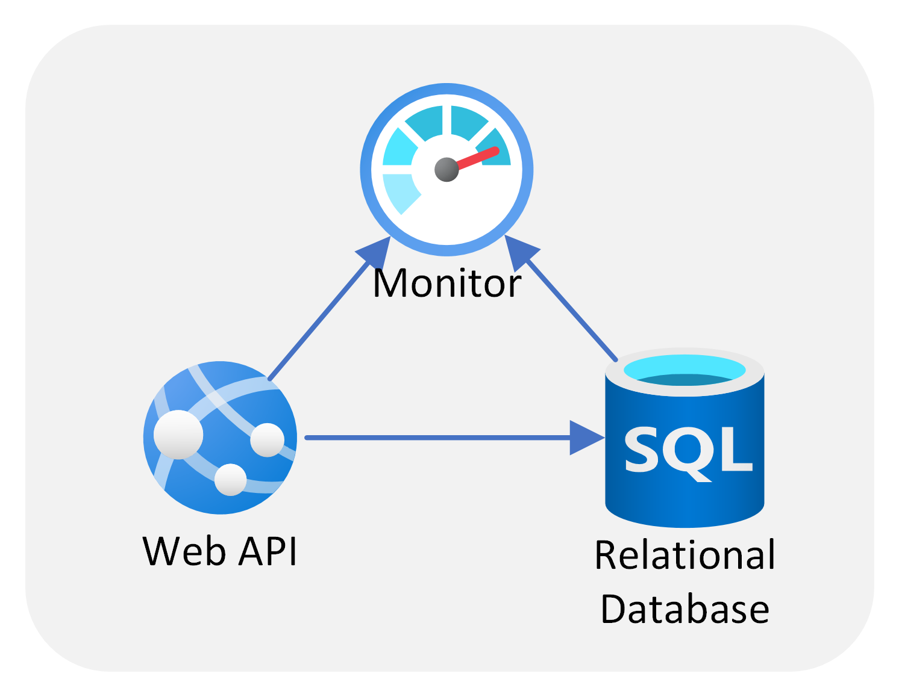

# Application Template for WebAPI and Database using Node.js and PostgreSQL

This repository contains a template of an application built for the Azure Application Platform. This template is built to make it easy to dive straight into implementing business logic without having to spend time on setting up an engineering system for your application. The templates give you a starting point, while providing the option to change and extend any of the pre-configured components to suit your needs. The template makes use of an opinionated pattern that Microsoft recommends.

This template pattern is designed for simple scenarios where you want an API to read and write from a backing relational database.

  

This template provides you with the following components: An Express-based WebAPI hosted on App Service Web App, a PostgreSQL database, and Application Insights and Log Analytics features of Azure Monitor.

## Template overview

The template provides:
- [A pre-configured development environment](/docs/concepts.md#development-environment)
- [An application](/docs/concepts.md#the-application)
- [Build and Deployment automation](/docs/concepts.md#build-and-deployment)

To get started using the template, we recommend following the [Quickstart](docs/quickstart.md).

For more information about the template, take a look at the [Concepts](docs/concepts.md) and [How-To Guides](docs/how-to-guides.md) docs as well.

## Available variations

The template pattern is available in the following variations

| Programming language | Framework |
| -------------------- | --------- |
| [C#](https://aka.ms/webapi-plus-database-dotnet)               | dotnet    |
| [javascript](/README.md)       | node.js   |

## Recommended usage

This template pattern is a good fit for scenarios where you want to expose relational data in a RESTful API via HTTPS.

A good example use-case is to retrieve and submit data from a front-end or client application, such as a mobile app or static web application.

## Not recommended usage

This template is not a good fit if you want to directly process large files (e.g. media, images), if you want to do further processing of the data before storing, or if you want to host a custom non-HTTPS server outside of standard ports 80/443 (e.g. a game server on TCP port 5000).

